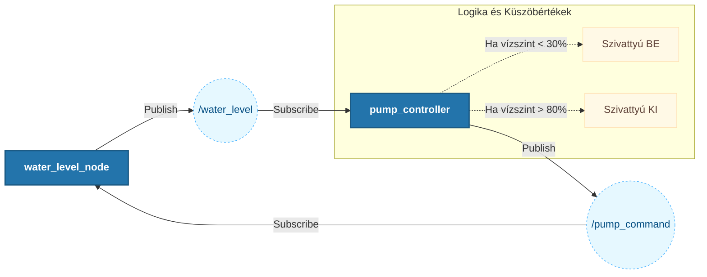

Egy víztorony szabályozása: A projekt célja egy szívattyú be- és kikapcsolása, hogy a víztorony a kívánt töltöttségi tartományban maradjon 30-tól 80%-ig. Ezáltal a lakosság megfelelő víznyomáson kapják az ívóvizet (3-4 bar).

